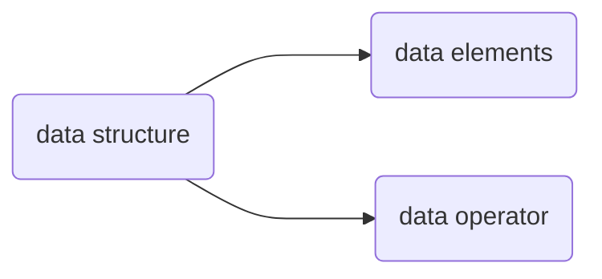

### Lecture 10 Containers
1. 数据结构的构成(class)

在面向对象语言中，我们一般称呼上面的东西为**类(class)**，其中包括数据结构中的元素，也包括可以对数据结构进行的操作(e.g.  constructor, +, - ...)
2. 在构建数据结构时需要遵循**data barrier**，即数据结构的使用者只需要通过注释来了解数据结构和其相关的操作，而不需要深入数据结构内部。而数据结构的创建者也只需要根据接口的需求来实现具体的接口，而不关心外部如何使用这个数据结构
这样就可以分开书写数据结构的内部和外部，降低复杂度。对于函数接口也是如此
3. python中关于函数框架中局部变量的细节
在Python中，进入函数时就立刻创建函数中的所有局部变量，并设其初值为`None`，不管其在之后函数的运行中能否被用到
keyword `nonlocal`:  使用`nonlocal`声明的变量表示当前`frame`中不会再创建新的局部变量，而是直接引用`parent frame`中的值，并且对变量赋值会改变`parent frame`中对应变量的值  `28:53`
